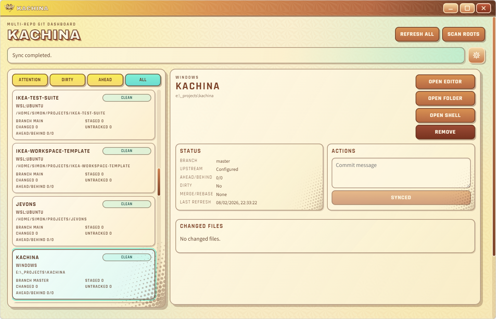

# Kachina

An opinionated utility I made to help me keep track of my Git repos on Windows and WSL.



## Overview
- Scans and discovers repositories from configured Windows and WSL roots.
- Highlights repos ahead/behind their remote, with uncommitted/untracked changes, or other problematic state.
- Has simple UI to stage/commit/pull/push changes, and actions to open the repo in VS Code, Explorer or Powershell.
- Runs Git commands in each repo's native environment:
  - Windows repo -> Windows `git`
  - WSL repo -> `git` inside that WSL distro


## Development

```bash
npm install
npm run dev
```

## Build

```bash
npm run build
npm run start
```

## Package For Windows

```powershell
npm run package:win
```

Notes:

- If `build/icons/kachina.ico` exists, packaging uses it as-is (best for preserving alpha/channel details).
- Otherwise, packaging generates `build/icons/kachina.ico` from `src/renderer/assets/kachina-twirly-icon.png` (or SVG as fallback).
- The icon is copied to `resources/assets/kachina.ico`, used by shortcuts, and stamped into `Kachina.exe` resources.

## License

MIT. See `LICENSE`.
