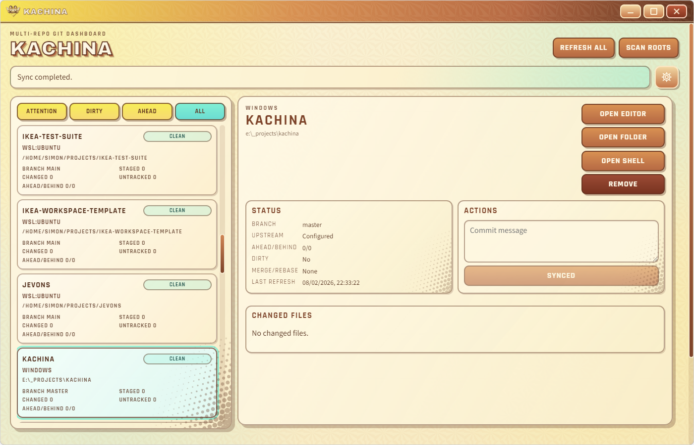

# Kachina

An opinionated utility I made to help me keep track of my Git repos on Windows and WSL.



## Overview
- Scans and discovers repositories from configured Windows and WSL roots.
- Highlights repos ahead/behind their remote, with uncommitted/untracked changes, or other problematic state.
- Has simple UI to stage/commit/pull/push changes, and actions to open the repo in VS Code, Explorer or Powershell.
- Runs Git commands in each repo's native environment:
  - Windows repo -> Windows `git`
  - WSL repo -> `git` inside that WSL distro


## Development

```bash
npm install
npm run dev
```

## Build

```bash
npm run build
npm run start
```

`npm run start` opens the Electron application. The same build can also run as
a browser application:

```bash
npm run start:web
```

The browser host listens only on `http://127.0.0.1:47831`. Kachina's HBOX Entry
starts this host on demand, waits for it to become ready, and opens it in the
default browser. `start:web` automatically rebuilds missing or stale output.
HBOX also shuts the host down when its managed session is stopped. Electron
and browser mode share the same state, so only one backend can run at a time.

## Package For Windows

```powershell
npm run package:win
```

Notes:

- If `build/icons/kachina.ico` exists, packaging uses it as-is (best for preserving alpha/channel details).
- Otherwise, packaging generates `build/icons/kachina.ico` from `src/renderer/assets/kachina-twirly-icon.png` (or SVG as fallback).
- The icon is copied to `resources/assets/kachina.ico`, used by shortcuts, and stamped into `Kachina.exe` resources.

## License

MIT. See `LICENSE`.
